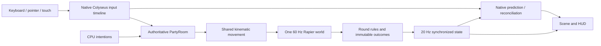

# Architecture

## Boundaries

| Directory | Responsibility |
|---|---|
| `apps/web` | React menus and settings, input adapters, native prediction, R3F scenes, HUD, local audio |
| `apps/server` | Colyseus PartyRoom, room lifecycle, authoritative MatchEngine, five controllers and CPU policies |
| `packages/shared` | Schema/protocol, manifests, map data, palette, timings, validation and tie scoring |
| `packages/simulation` | Kinematic Rapier movement and swept projectile/ownership logic; no React, DOM or rendering imports |
| `tests` | Deterministic rules/soak, real SDK integration/load, real-clock Chrome journeys and traffic impairment |

Server controllers are not imported into the browser application. Tests may import controllers to drive independent SDK clients with ordinary input intentions. These test policies do not set server positions, lives, ownership, finishes or scores.

## Authority and timing

PartyRoom consumes at most one input per connected participant per 60 Hz step. It then calls MatchEngine, which resolves actions, moves each eligible character, advances the physics world once, and batches consequences before placements. Colyseus acknowledgement corresponds to consumed input. Last input is neutralized after 250 ms; wrong-round input is rejected. Player capsules do not block other player capsules.

The browser uses one `Predict`/`sim` driver and a separate kinematic prediction world. Movement state lives in schema fields, not hidden dynamic rigid-body velocity. Physics bodies are restored from that state before queries. Remote players interpolate with a 100 ms delay. Map changes and reconnect epochs recreate the relevant prediction runtime and listeners; the SDK owns the input timeline and reconciliation.

## Contracts

- `InputFrame`: normalized axes, jump/action state and edges, aim direction, round ID. No client-authoritative position, hit, item owner, score or finish time.
- `RoundManifest`: stable IDs, bilingual copy, category, objectives, controls and configured duration.
- `MapDefinition`: shared spawn positions, collision boxes and visual placement data. Checkpoints and Paandi support helpers are shared authored data.
- `RoundController`: start, before-movement actions, after-movement consequences, movement eligibility, ordinary bot inputs, outcome, disconnect and cleanup.
- Views are React components selected from synchronized round state; they share a resource/prediction lifetime in `World` rather than an imperative view inheritance hierarchy.
- `RoundOutcome`: unique ID, placement groups, tied slots, qualifiers, metrics/reason and points; Seven Stones also records both attacking heats.

Outcomes are cloned and frozen on the server. An outcome ID can award points once. Festival preserves eight participants for every round. Knockout uses a separate eligibility flag, retaining eliminated logical slots for spectating while only qualifiers enter the next controller.

## State machine

`LOBBY → optional VOTING → ROUND_SELECTED → LOADING → BRIEFING → COUNTDOWN → PLAYING → ROUND_RESULTS → next round / MATCH_RESULTS → LOBBY`

Reveal lasts 2 s, briefing 5 s, countdown 3 s and intermediate results 6 s. Loading has a 30 s wall-clock deadline and requires each human's round/content acknowledgement. Seven Stones has internal opening, active and role-swap states; its two heats produce one outcome.

Host changes invalidate readiness. A disconnected seat is reserved for 15 s. Host permission transfers after 5 s to the longest-connected remaining human. Disconnect clears held input and carried items; expiry changes the existing slot into a labelled CPU with current health/progress. All-human departure ends an active match as no-contest. The abandoned room is disposed after 30 s without humans/reservations.

Room metadata and match history remain in server memory. Refresh tokens live only in per-tab session storage. Personal preferences and cosmetic preset live in local storage. No remote persistence is required.

## Collision and gameplay

The shared controller uses a 1.65 m capsule, 0.35 m radius, 5.5 m/s speed, acceleration 30, gravity -24, jump velocity 7.8, air steering 0.55, six-tick coyote time and eight-tick jump buffer. Vaults follow bounded, collision-checked arcs; their speed bonus is capped at 1.1×.

Projectile hits sweep each travel segment against expanded world geometry and player capsules. A live ball damages once, excludes its owner, and respects protection. Pickups gather eligible claims before ownership is assigned; exact/near-numerical ties remain unassigned. Stone hits cancel placement before that tick can commit a completed stone.

Kalla Manna's unpublished random sequence stays server-owned. CPU decisions use the current published call. Paandi markers are deliberately shared challenges, with separate per-player retrieval state.

## Rendering and cleanup

Procedural geometry uses an instancing pool keyed by geometry and material type. Bone-like groups drive animation transforms; meshes are batched across players and scenery. Empty batches, label textures, physics worlds, event handlers and prediction drivers are disposed when their ownership ends. Audio oscillators disconnect on completion. No external image, font or audio service is used.

`render_game_to_text` and F3 diagnostics are read-only development tools. The production build omits them unless explicitly enabled. There is no normal-browser hook for advancing the shared clock; deterministic stepping occurs only inside isolated tests.
